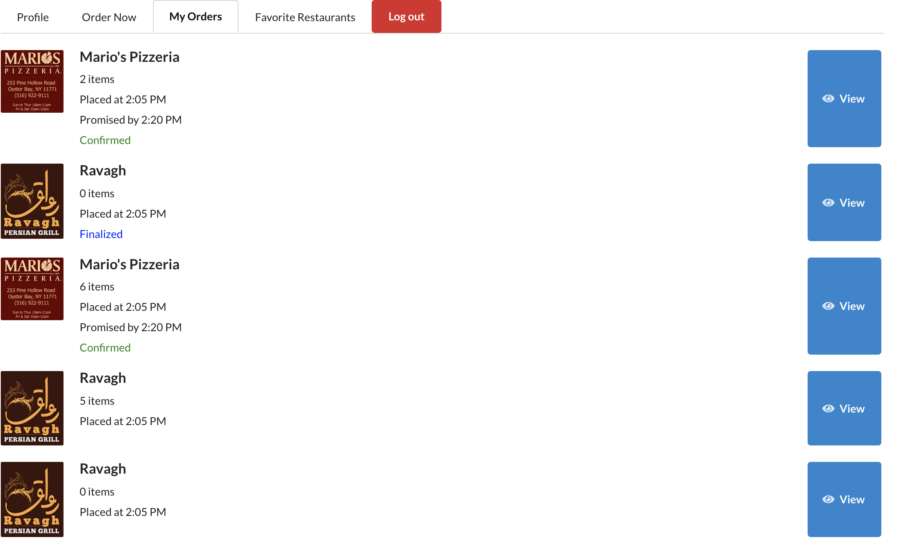
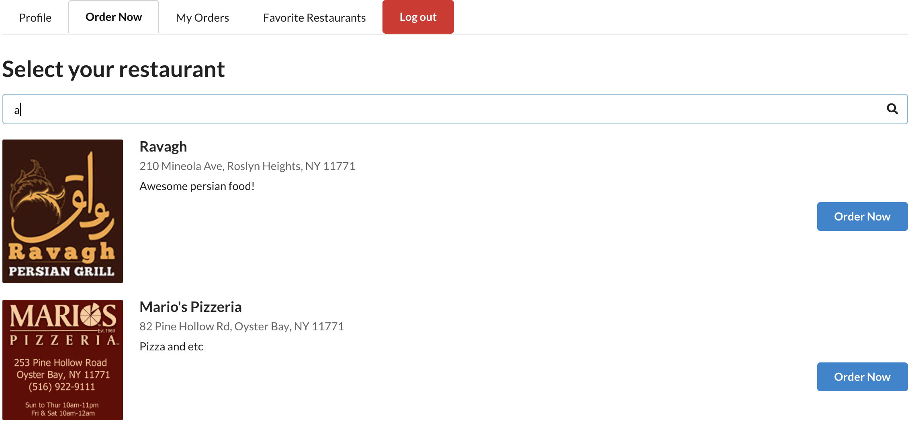
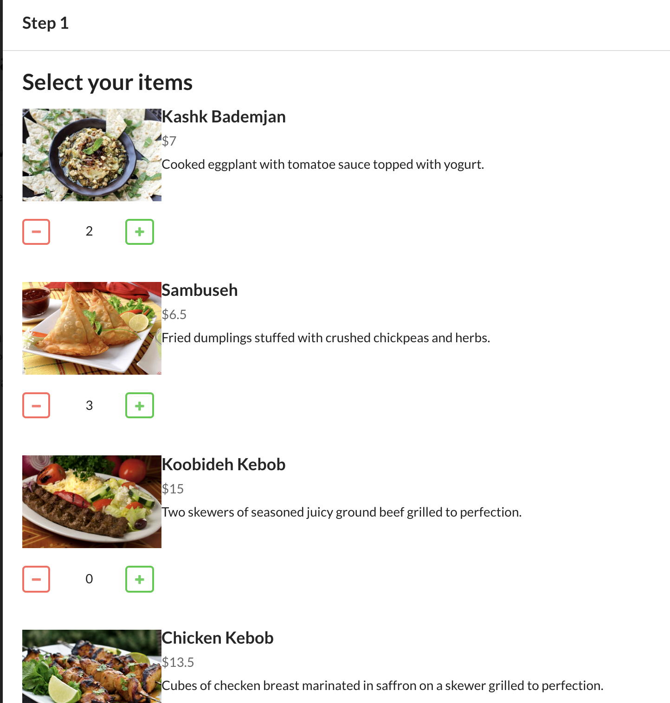
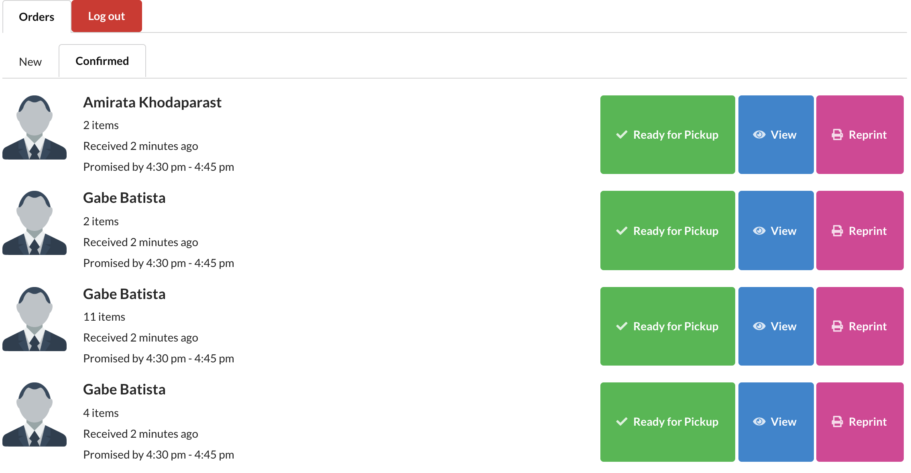
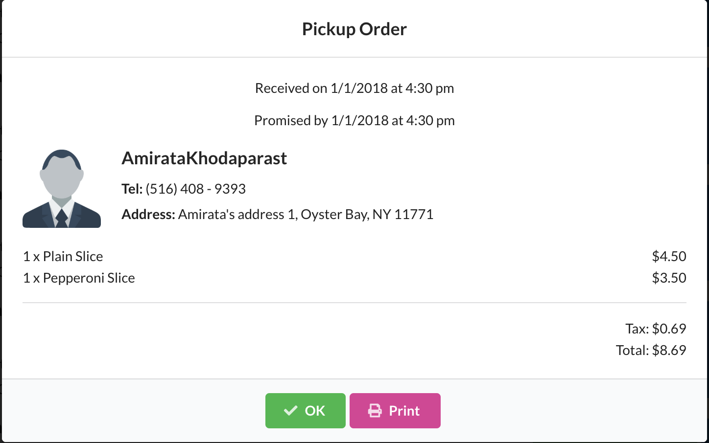
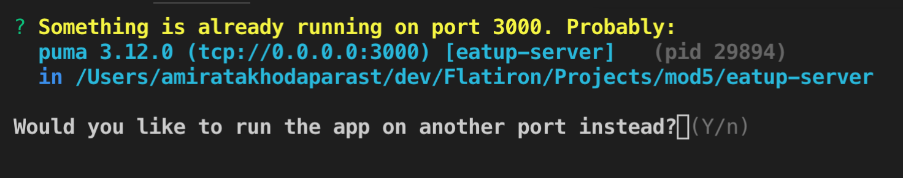
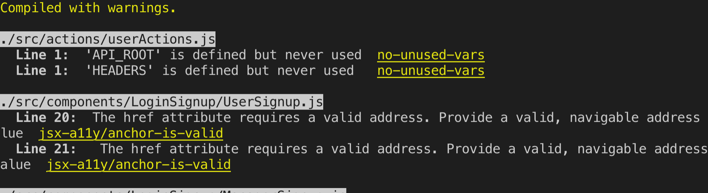

# Eatup

Eatup allows restaurants to receive online orders from customers in real time.

## Motivation

This app was created with the idea of fixing real time problems that happen in other online ordering services.

## Demo

Watch a short demo of how this app works on [Youtube](https://youtu.be/O9pYRAWddMY)!

## Screenshots

### User Views





### Manager Views




## Tech/framework used

- [React.js](https://reactjs.org/)
- [Redux.js](https://redux.js.org/)
- [Semantic UI React](https://react.semantic-ui.com/)
- [React Router](https://github.com/ReactTraining/react-router/tree/master/packages/react-router-dom)
- [Redux Thunk](https://github.com/reduxjs/redux-thunk)

## Features

- Developed a **Single Page Application** with **React** and **Redux**
- Used **Rails' Actioncables** to integrate **Websockets** to broadcast orders between the managers and customers in **real time**
- Designed the user interface employing **Semantic Ui React**
- Incorporated **JWT** in order to implement secure login, websocket connection and HTTP requests.

## Installation

Before anything be sure to start the back end server and set up your database. Click [here](http://github.com/amiratak88/eatup-server) for the server's repository.

Once you're done setting up the API, follow these steps:

- Use this [link](https://nodejs.org/en/download/) to install Node.js and npm if you haven't already. 

- Fork and clone this repository.

- Navigate to the root folder of the cloned repo in you terminal and run this command:
```
npm instal && npm start
```
- Enter **y** for yes if you were prompted with this question:



- If you see something similar to this, you have successfully booted up the client server and it should be running on port **3001**.



## Contribute

Interested in contributing to this repository? Check out the [CONTRIBUTION.md] file.

## Credits

I want to thank all my instructors and classmates at Flatiron school especially:
- Prince Wilson
- Niky Morgan
- Eric Kim
- Tony Lam

## License

This project is licensed under the MIT License - see the [LICENSE.md](LICENSE.md) file for details